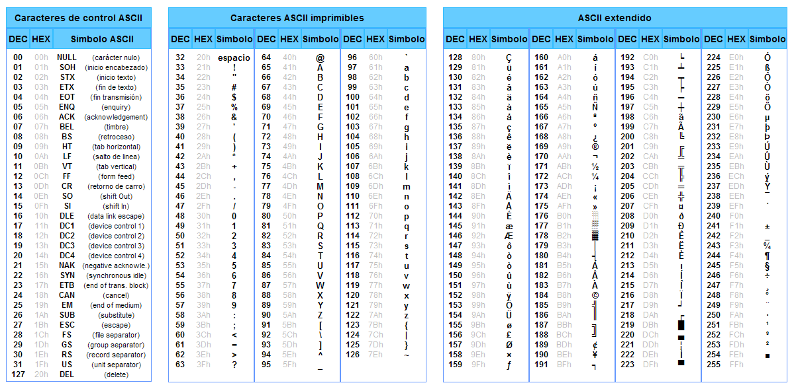

<h1 align="center">Hand Programming Language Kata</h1>

    

# Objetivo

El objetivo de esta kata es aplicar y perfeccionar las técnicas de TDD y Extreme Programming al desarrollar un compilador para un lenguaje basado en emojis.

### Funcionamiento

Este lenguaje modifica una memoria de tamaño indefinido, compuesta por celdas que empiezan inicializadas a 0.

* 👉 mueve el puntero de memoria a la siguiente celda
* 👈 mueve el puntero de memoria a la celda anterior
* 👆 incrementa el valor de la celda de memoria actual
* 👇 disminuye el valor de la celda de memoria actual
* 👊 muestra el valor de la celda actual según su equivalencia en ASCII
* 🤜 si la celda de memoria en la posición actual tiene valor 0, salta justo después del 🤛 correspondiente
* 🤛 si la celda de memoria en la posición actual no tiene valor 0, salta justo después de la 🤜 correspondiente

    

#### [⚠️](https://emojiterra.com/es/senal-de-advertencia/) Aclaraciones

* Dado que en esta kata se prioriza practicar el desarrollo del software y que el reto planteado puede abordarse de diferentes maneras. Se establecen estas restricciones:
  * El paradigma de programación es procedimental (solo funciones, nada de [OO](https://es.wikipedia.org/wiki/Programaci%C3%B3n_orientada_a_objetos))
  * Se parte de unas funciones vacías, ya incorporadas, que hay que implementar usando TDD

- Las celdas de memoria son bytes, con un valor de 0 al 255
  - Si disminuyes 0 obtendrás 255
  - Si incrementas 255 obtendrás 0
- La memoria se puede incrementar de manera “infinita”, pero si disminuyes la dirección de memoria 0, tendrás que devolver la mayor dirección de memoria conocida.

## Retos

#### **1. Leer posiciones de memoria**

* Implementa la función `readMemoryAddress` para acceder a los valores de la memoria en una posición dada

#### **2. Incrementa el valor de una posición de memoria**

* Implementa la función `increaseMemoryAddress` para incrementar el valor de la celda de memoria actual

#### **3. Decrementa el valor de una posición de memoria**

* Implementa la función `decreaseMemoryAddress` para disminuir el valor de la celda de memoria actual

#### **4. Incrementa puntero de memoria**

* Implementa la función `moveMemoryPointer` para mover el puntero de memoria a la siguiente celda

#### **5. Decrementa el puntero de memoria**

* Implementa la función `moveMemoryPointer` para mover el puntero de memoria a la celda anterior

#### **6. Ejecuta el siguiente programa para obtener "A"**

* 👆👆👆👆👆👆👆👆👆👆👆👆👆👆👆👆👆👆👆👆👆👆👆👆👆👆👆👆👆👆👆👆👆👆👆👆👆👆👆👆👆👆👆👆👆👆👆👆👆👆👆👆👆👆👆👆👆👆👆👆👆👆👆👆👆👊

#### **7. Ejecuta el siguiente programa para obtener "Hola"**

* 👇👇👇👇👇👇👇👇👇👇👇👇👇👇👇👇👇👇👇👇👇👇👇👇👇👇👇👇👇👇👇👇👇👇👇👇👇👇👇👇👇👇👇👇👇👇👇👇👇👇👇👇👇👇👇👇👇👇👇👇👇👇👇👇👇👇👇👇👇👇👇👇👇👇👇👇👇👇👇👇👇👇👇👇👇👇👇👇👇👇👇👇👇👇👇👇👇👇👇👇👇👇👇👇👇👇👇👇👇👇👇👇👇👇👇👇👇👇👇👇👇👇👇👇👇👇👇👇👇👇👇👇👇👇👇👇👇👇👇👇👇👇👇👇👇👇👇👇👇👇👇👇👇👇👇👇👇👇👇👇👇👇👇👇👇👇👇👇👇👇👇👇👇👇👇👇👇👇👇👇👇👇👇👇👊👉👇👇👇👇👇👇👇👇👇👇👇👇👇👇👇👇👇👇👇👇👇👇👇👇👇👇👇👇👇👇👇👇👇👇👇👇👇👇👇👇👇👇👇👇👇👇👇👇👇👇👇👇👇👇👇👇👇👇👇👇👇👇👇👇👇👇👇👇👇👇👇👇👇👇👇👇👇👇👇👇👇👇👇👇👇👇👇👇👇👇👇👇👇👇👇👇👇👇👇👇👇👇👇👇👇👇👇👇👇👇👇👇👇👇👇👇👇👇👇👇👇👇👇👇👇👇👇👇👇👇👇👇👇👇👇👇👇👇👇👇👇👇👇👇👇👊👉👆👆👆👆👆👆👆👆👆👆👆👆👆👆👆👆👆👆👆👆👆👆👆👆👆👆👆👆👆👆👆👆👆👆👆👆👆👆👆👆👆👆👆👆👆👆👆👆👆👆👆👆👆👆👆👆👆👆👆👆👆👆👆👆👆👆👆👆👆👆👆👆👆👆👆👆👆👆👆👆👆👆👆👆👆👆👆👆👆👆👆👆👆👆👆👆👆👆👆👆👆👆👆👆👆👆👆👆👊👉👆👆👆👆👆👆👆👆👆👆👆👆👆👆👆👆👆👆👆👆👆👆👆👆👆👆👆👆👆👆👆👆👆👆👆👆👆👆👆👆👆👆👆👆👆👆👆👆👆👆👆👆👆👆👆👆👆👆👆👆👆👆👆👆👆👆👆👆👆👆👆👆👆👆👆👆👆👆👆👆👆👆👆👆👆👆👆👆👆👆👆👆👆👆👆👆👆👊

#### **8. Condicionales**

* Implementa la lógica para las instrucciones de salto condicional (`🤜` y `🤛`) usando las funciones existentes para leer valores de memoria y manejar el flujo del programa según los valores

#### **9. Ejecuta el siguiente programa para obtener "Hola, Turing"**

* 👆👆👆👆👆👆👆👆👆👆👆👆👆👆👆👆👆👆👆👆👆👆👆👆👆👆👆👆👆👆👆👆👆👆👆👆👆👆👆👆👆👆👆👆👆👆👆👆👆👆👆👆👆👆👆👆👆👆👆👆👆👆👆👆👆👆👆👆👆👆👆👆👊👉👆👆👆👆👆👆👆👆👆👆👆👆👆👆👆👆👆👆👆👆👆👆👆👆👆👆👆👆👆👆👆👆👆👆👆👆👆👆👆👆👆👆👆👆👆👆👆👆👆👆👆👆👆👆👆👆👆👆👆👆👆👆👆👆👆👆👆👆👆👆👆👆👆👆👆👆👆👆👆👆👆👆👆👆👆👆👆👆👆👆👆👆👆👆👆👆👆👆👆👆👆👆👆👆👆👆👆👆👆👆👆👊👉👆👆👆👆👆👆👆👆👆👆👆👆👆👆👆👆👆👆👆👆👆👆👆👆👆👆👆👆👆👆👆👆👆👆👆👆👆👆👆👆👆👆👆👆👆👆👆👆👆👆👆👆👆👆👆👆👆👆👆👆👆👆👆👆👆👆👆👆👆👆👆👆👆👆👆👆👆👆👆👆👆👆👆👆👆👆👆👆👆👆👆👆👆👆👆👆👆👆👆👆👆👆👆👆👆👆👆👆👊👉👇👇👇👇👇👇👇👇👇👇👇👇👇👇👇👇👇👇👇👇👇👇👇👇👇👇👇👇👇👇👇👇👇👇👇👇👇👇👇👇👇👇👇👇👇👇👇👇👇👇👇👇👇👇👇👇👇👇👇👇👇👇👇👇👇👇👇👇👇👇👇👇👇👇👇👇👇👇👇👇👇👇👇👇👇👇👇👇👇👇👇👇👇👇👇👇👇👇👇👇👇👇👇👇👇👇👇👇👇👇👇👇👇👇👇👇👇👇👇👇👇👇👇👇👇👇👇👇👇👇👇👇👇👇👇👇👇👇👇👇👇👇👇👇👇👇👇👇👇👇👇👇👇👇👇👇👇👇👇👊👉👇👇👇👇👇👇👇👇👇👇👇👇👇👇👇👇👇👇👇👇👇👇👇👇👇👇👇👇👇👇👇👇👇👇👇👇👇👇👇👇👇👇👇👇👇👇👇👇👇👇👇👇👇👇👇👇👇👇👇👇👇👇👇👇👇👇👇👇👇👇👇👇👇👇👇👇👇👇👇👇👇👇👇👇👇👇👇👇👇👇👇👇👇👇👇👇👇👇👇👇👇👇👇👇👇👇👇👇👇👇👇👇👇👇👇👇👇👇👇👇👇👇👇👇👇👇👇👇👇👇👇👇👇👇👇👇👇👇👇👇👇👇👇👇👇👇👇👇👇👇👇👇👇👇👇👇👇👇👇👇👇👇👇👇👇👇👇👇👇👇👇👇👇👇👇👇👇👇👇👇👇👇👇👇👇👇👇👇👇👇👇👇👇👇👇👇👇👇👇👇👇👇👇👇👇👇👇👇👇👇👇👇👊👉👆👆👆👆👆👆👆👆👆👆👆👆👆👆👆👆👆👆👆👆👆👆👆👆👆👆👆👆👆👆👆👆👊👉👇👇👇👇👇👇👇👇👇👇👇👇👇👇👇👇👇👇👇👇👇👇👇👇👇👇👇👇👇👇👇👇👇👇👇👇👇👇👇👇👇👇👇👇👇👇👇👇👇👇👇👇👇👇👇👇👇👇👇👇👇👇👇👇👇👇👇👇👇👇👇👇👇👇👇👇👇👇👇👇👇👇👇👇👇👇👇👇👇👇👇👇👇👇👇👇👇👇👇👇👇👇👇👇👇👇👇👇👇👇👇👇👇👇👇👇👇👇👇👇👇👇👇👇👇👇👇👇👇👇👇👇👇👇👇👇👇👇👇👇👇👇👇👇👇👇👇👇👇👇👇👇👇👇👇👇👇👇👇👇👇👇👇👇👇👇👇👇👇👇👇👇👊👉👇👇👇👇👇👇👇👇👇👇👇👇👇👇👇👇👇👇👇👇👇👇👇👇👇👇👇👇👇👇👇👇👇👇👇👇👇👇👇👇👇👇👇👇👇👇👇👇👇👇👇👇👇👇👇👇👇👇👇👇👇👇👇👇👇👇👇👇👇👇👇👇👇👇👇👇👇👇👇👇👇👇👇👇👇👇👇👇👇👇👇👇👇👇👇👇👇👇👇👇👇👇👇👇👇👇👇👇👇👇👇👇👇👇👇👇👇👇👇👇👇👇👇👇👇👇👇👇👇👇👇👇👇👇👇👇👇👇👇👊👉👇👇👇👇👇👇👇👇👇👇👇👇👇👇👇👇👇👇👇👇👇👇👇👇👇👇👇👇👇👇👇👇👇👇👇👇👇👇👇👇👇👇👇👇👇👇👇👇👇👇👇👇👇👇👇👇👇👇👇👇👇👇👇👇👇👇👇👇👇👇👇👇👇👇👇👇👇👇👇👇👇👇👇👇👇👇👇👇👇👇👇👇👇👇👇👇👇👇👇👇👇👇👇👇👇👇👇👇👇👇👇👇👇👇👇👇👇👇👇👇👇👇👇👇👇👇👇👇👇👇👇👇👇👇👇👇👇👇👇👇👇👇👊👉👇👇👇👇👇👇👇👇👇👇👇👇👇👇👇👇👇👇👇👇👇👇👇👇👇👇👇👇👇👇👇👇👇👇👇👇👇👇👇👇👇👇👇👇👇👇👇👇👇👇👇👇👇👇👇👇👇👇👇👇👇👇👇👇👇👇👇👇👇👇👇👇👇👇👇👇👇👇👇👇👇👇👇👇👇👇👇👇👇👇👇👇👇👇👇👇👇👇👇👇👇👇👇👇👇👇👇👇👇👇👇👇👇👇👇👇👇👇👇👇👇👇👇👇👇👇👇👇👇👇👇👇👇👇👇👇👇👇👇👇👇👇👇👇👇👇👇👇👇👇👇👊👉👆👆👆👆👆👆👆👆👆👆👆👆👆👆👆👆👆👆👆👆👆👆👆👆👆👆👆👆👆👆👆👆👆👆👆👆👆👆👆👆👆👆👆👆👆👆👆👆👆👆👆👆👆👆👆👆👆👆👆👆👆👆👆👆👆👆👆👆👆👆👆👆👆👆👆👆👆👆👆👆👆👆👆👆👆👆👆👆👆👆👆👆👆👆👆👆👆👆👆👆👆👆👆👆👆👆👆👆👆👆👊👉👆👆👆👆👆👆👆👆👆👆👆👆👆👆👆👆👆👆👆👆👆👆👆👆👆👆👆👆👆👆👆👆👆👆👆👆👆👆👆👆👆👆👆👆👆👆👆👆👆👆👆👆👆👆👆👆👆👆👆👆👆👆👆👆👆👆👆👆👆👆👆👆👆👆👆👆👆👆👆👆👆👆👆👆👆👆👆👆👆👆👆👆👆👆👆👆👆👆👆👆👆👆👆👊

# Esta kata es un fork de [hand-challenge](https://github.com/jesus-seijas-sp/hand-challenge) por [Jesús Seijas](https://github.com/jesus-seijas-sp)

# Base para hacer tests

Configuración básica para empezar a hacer una kata o aprender a hacer tests en los siguientes lenguajes:

- PHP con PHPUnit
- Javascript con Jest
- Typescript con Node
- Typescript con Deno
- Java con Junit y Mockito
- Scala con Munit y Scalacheck
- Kotlin con JUnit5 y MockK
- C# con xUnit (FluentAsertion) y NSubstitute (para mock)

# Configuración específica por lenguaje

## PHP con PHPUnit

1. Instalar [composer](https://getcomposer.org/) `curl -sS https://getcomposer.org/installer | php`
2. `composer install` (estando en la carpeta php)
3. `vendor/bin/phpunit` o `composer test`

### 📚 Documentación

- [PHPUnit](https://phpunit.readthedocs.io/)

## Javascript con Jest

1. Instalar [Node](http://nodejs.org/)
2. `npm install` (Estando en la carpeta javascript)
3. `npm test`

### 📚 Documentación

- [Jest](https://jestjs.io)

## [Typescript con Node](/typescript/README.md)

## Typescript con Deno

1. Instalar [Deno](https://deno.land/#installation)
2. `deno test` (Estando en la carpeta typescript)

### 📚 Documentación

- [Deno](https://deno.land/manual)
- [BDD module](https://deno.land/manual/testing/behavior_driven_development)
- [Expect module](https://deno.land/x/expect)

## Java con Junit y Mockito

1. Instalar las dependencias y tests con Maven [mvn test]
2. Ejecutar los tests con el IDE

### 📚 Documentación

- [JUnit](https://github.com/junit-team/junit/wiki)
- [Mockito](http://site.mockito.org/mockito/docs/current/org/mockito/Mockito.html)

## Scala con Munit y Scalacheck

1. `sbt` (en la carpeta scala)
2. `~test` para ejecutar los test en hot reload

### 📚 Documentación

- [Munit](https://scalameta.org/munit/docs/tests.html)
- [Scalacheck](https://github.com/typelevel/scalacheck/blob/main/doc/UserGuide.md) para testing basado en propiedades

### Linux/Mac

1. Instalar [SDKMan](https://sdkman.io/)
2. `sdk install java 11.0.12-open` instala OpenJDK
3. `sdk install sbt` una vez instalado SDKMan

### Windows

1. Instalar [OpenJDK](https://docs.microsoft.com/es-es/java/openjdk/download#openjdk-110141-lts--see-previous-releases)
2. Instalar [SBT](https://www.scala-sbt.org/download.html)

### Visual Studio Code

1. Descargar [Visual Studio Code](https://code.visualstudio.com/)
2. Instalar para VS Code [Metals](https://scalameta.org/metals/docs/editors/vscode)

## Kotlin con JUnit5 y MockK

1. Por consola: Puedes instalar dependencias y lanzar los tests con `gradlew test`
2. Usando IDE: Simplemente abre el proyecto desde el raiz de la plantilla Kotlin

### 📚 Documentación

- [JUnit5](https://junit.org/junit5/)
- [MockK](https://mockk.io/)

## C# con xUnit (con FluentAsertion) y NSubstitute (para mock)

1. Instalar Microsoft Visual Studio Community 2022
2. Abre el proyecto y se descargaran automáticamente los paquetes Nuguet necesarios

### 📚 Documentación

- [xUnit](https://xunit.net/)
- [NSubstitute](https://nsubstitute.github.io/help.html)
- [FluentAssertions](https://fluentassertions.com/introduction)

## Python

1. Instalar python 3.x
2. Una vez descargado el código fuente dentro de la carpeta */python/ creamos un virtual enviroment:
3. `python3 -m venv env`
4. Activamos en virtual environment:

- windows: `.\env\Scripts\activate.bat`
- linux/mac: `source env/bin/activate`

5. `pytest` para ejecutar los tests.
